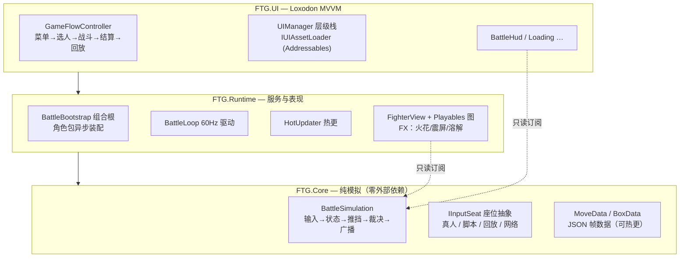
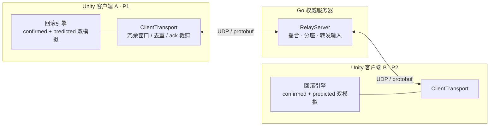

# FTG · 确定性格斗游戏客户端框架

> Unity 2022.3 客户端作品集项目：**为回滚网络设计的确定性 60Hz 格斗游戏框架** + **完整内容管线**（编辑器工具 → 数据驱动 → Addressables → 热更新）。表现对标街霸6；**rollback netcode + Go 权威服务器已实现**——C# 客户端与 Go 服务器两套独立实现逐帧哈希零分歧（见 [网络](#网络确定性回滚--go-权威服务器)）。

<!-- TODO: 把 CI 徽章的 OWNER/REPO 换成实际仓库 -->
<!--  -->

<!-- TODO: 录 3 张 GIF 放 docs/img/：连段与取消 / 拼招金闪 / 改帧数据热更前后对比 -->
<!--  -->

---

## 技术亮点（每条都能在代码里指认）

| 亮点 | 实现 | 入口 |
|---|---|---|
| **确定性模拟** | 60Hz 固定步长纯 C# 模拟；无 Time/Random；FNV-1a 帧哈希双跑一致 + 回放逐帧一致由测试钉死 | `BattleSimulation` · `BattleSimulationTests` |
| **回滚网络 + Go 服务器** | 确定性核心跨语言移植到 Go；预测/存档/重模拟 rollback + 真 UDP 中继服务器 + 抗丢包/带宽裁剪；跨语言 180 帧零分歧 | `server/` · `docs/NETWORKING.md` |
| **编译期纯净** | asmdef 四层拆分，`FTG.Core` 零外部引用——模拟纯净是编译器保证的 | `FTG.Core.asmdef` |
| **回放系统** | 确定性的直接收益：每帧 6 字节输入流即完整存档（FTGR 二进制），回放=换一个输入座位 | `Replay/` · `IInputSeat` |
| **输入系统** | 环形缓冲 + 搓招回溯匹配（镜像/蓄力/优先级仲裁）+ 预输入指令队列 + 顿帧不老化缓冲 | `MotionDetector` · `CommandQueue` |
| **UI 架构** | 层级栈 UIManager（5 层 Canvas/生命周期/异步加载）+ Loxodon MVVM（UI 是模拟的只读观察者） | `UIManager` · `BattleHudViewModel` |
| **资源管线 + 热更** | 全资产 Addressables（UI/角色/帧数据），角色即内容包（按地址异步装配）；remote catalog 增量热更**实测通过**：改帧数据 JSON 不发版即生效 | `HotUpdater` · `BattleBootstrap` |
| **Playables 动画** | PlayableGraph 直驱 clip（Manual 模式），播放头被逻辑帧钉死；契约收窄为「Clip 名 = MoveId」 | `FighterAnimationPlayer` |
| **0GC 战斗循环** | 逐分配点审计：闭包提升为缓存谓词；含「明确不做」清单及理由 | `docs/PERFORMANCE.md` |
| **打击感** | 手写 HLSL（程序化噪声溶解/拼招金闪，SRP Batcher 兼容）+ trauma 模型震屏 + 粒子对象池 + 判定层精确接触点 | `FX/` · `HitEvent.ContactPoint` |
| **编辑器工具链** | 判定框可视化编辑器（版本迁移/合并写入）、RootMotion 批量烘焙、动画契约校验器 | `Assets/Editor/EditorTools/` |
| **测试 + CI** | 30+ C# EditMode 用例（确定性/搓招表/回合流/连击/回放）+ Go 服务器 `go test -race`（对拍/回滚/健壮性），GitHub Actions 双作业自动跑 | `Assets/Tests/` · `server/` · `.github/workflows/` |

## 架构总览



依赖单向：`UI → Runtime → Core`，反向编译不过。表现层（HUD/FX/录制）一律只读订阅模拟事件。

## 每帧管线

```
朝向同步 → 输入采样(双方同帧) → 招式/移动状态机 → 推挡解算 → 攻防裁决 → 帧末广播
```

裁决顺序：无敌 → 当身 → 投/拆投 → 拒止 → 防御 → 命中/Counter Hit。位置权威归逻辑帧数据（RootMotion 烘焙 JSON），动画只是显示器。

## 网络：确定性回滚 + Go 权威服务器

整个模拟核心是**为回滚网络设计**的：定点数（Q16.16，无浮点）、纯函数式推进、每帧 FNV-1a 状态哈希。这条纪律的回报是一整套已实现、有测试兜底的联机栈——**C# 客户端与 Go 服务器两套独立实现，喂同一份输入逐帧哈希零分歧**。



服务器只做撮合与输入转发（权威在于分配座位、下发权威开局头）；**每帧模拟在客户端本地跑回滚**——本地输入零延迟生效，远端输入用预测先行，真输入到达再回退重模拟。同一份 `.proto` 是 C#/Go 唯一契约源。

| 阶段 | 内容 | 验证 |
|---|---|---|
| **N1–N2 定点核心** | Q16.16 定点数 + 全模拟换型（float 只留装载/渲染边界） | 逐位镜像 C#，`go test` |
| **N3 协议** | protobuf 单一契约源 → C#/Go 双向生成 | 枚举/往返守卫测试 |
| **N4 跨语言对拍** | Go 无头移植整条模拟核心 | **180 帧逐帧 FNV-1a 零分歧** |
| **N5 帧同步 + 回滚** | 输入延迟 lockstep → 预测/存档/重模拟 rollback | 两端 = 单机参照，逐位一致 |
| **N6 真 UDP + 健壮性** | 中继服务器 + UDP 传输 + 冗余窗口 + 连接质量 | 30% 丢包/抖动/乱序下仍逐位正确 |

**关键结果**：跨语言 180 帧零分歧 · 30% 丢包下「无冗余卡死、冗余照常收敛」的判决性对照 · ack 裁剪省 **79%** 带宽 · 不依赖墙钟的 RTT/掉线统计。Go 侧（`server/`）全部 `go test -race` 绿并挂 CI。细节见 [docs/NETWORKING.md](docs/NETWORKING.md)。

## 里程碑

- [x] **M1 工程地基**：asmdef 拆分 · 30+ 测试 · CI
- [x] **M2 UI/流程**：UIManager · MVVM HUD · 完整游戏循环 · 回合/计时/连击
- [x] **M2.5 表现包**：回放系统 · 手写 Shader · 震屏 · 粒子池（SF6 式打击反馈）
- [x] **M3 资源/热更**：Addressables 全迁移 · 角色即内容包 · remote catalog 热更实测
- [x] **M4 优化**：0GC 战斗循环 · Playables 动画直驱
- [x] **网络（北极星）**：定点数 → 跨语言逐帧对拍 → 帧同步 → 预测回滚 → 真 UDP + 健壮性（Go 权威服务器；`server/` `go test -race` + CI）
- [ ] **M5 展示层**：GIF/演示视频 · 性能数字补全（进行中）

## 快速开始

1. Unity 2022.3.61f3 打开工程，场景 `Assets/Scenes/SampleScene`
2. Addressables Play Mode Script 选 **Use Asset Database**（开发模式，无需构建）
3. Play：主菜单 → 选人 → 战斗（P1/P2 键位见 Input Action Asset）→ 结算 → 主菜单可看最近一场回放
4. 热更演示与出包流程见 [docs/ENGINEERING.md](docs/ENGINEERING.md)

## 文档

- [ENGINEERING.md](docs/ENGINEERING.md) — 分层架构、设计原则（位置权威/座位分离/Messenger 红线）、动画契约、工作流
- [PERFORMANCE.md](docs/PERFORMANCE.md) — 0GC 审计、测量方法论、明确不做的优化及理由
- [NETWORKING.md](docs/NETWORKING.md) — 协议契约、跨语言对拍、帧同步/回滚、真 UDP 传输与网络健壮性
